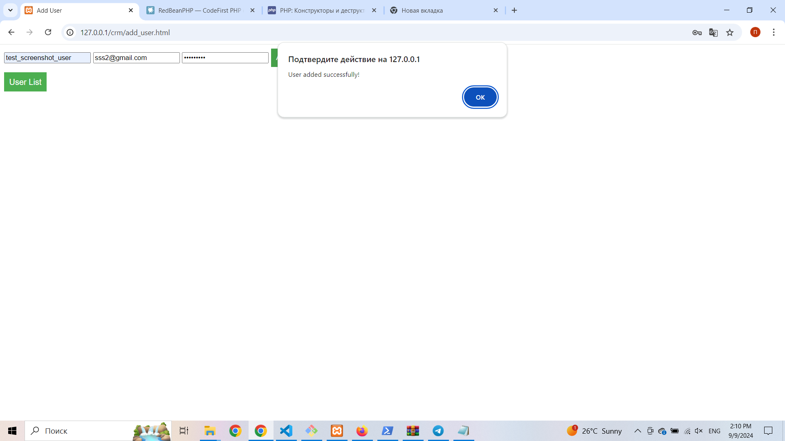
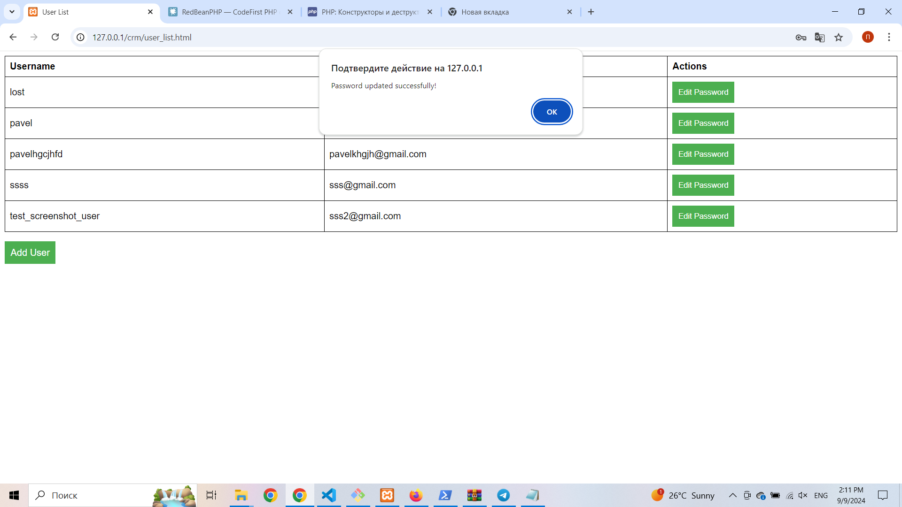

# CRM System

## Опис

Цей проект є модулем CRM системи для афілейт менеджерів, який реалізує можливість додавання користувачів та редагування їх паролів через REST API.

## Вимоги

- PHP 7.4+
- MySQL
- ReadBean PHP ORM
- JavaScript (Fetch/AJAX)

## Інструкції

1. **Налаштування бази даних**:
   - Створіть базу даних crm та таблицю user.

2. **Запуск проекту**:
   - Налаштуйте веб-сервер для обробки запитів до папки api та фронтенду.

3. **Тестування**:
   - Додайте користувачів через форму на сторінці add_user.html.
   - Перевірте список користувачів на сторінці user_list.html та можливість редагування паролів.

## Скріншоти

1. Успішне додавання користувача:
   

2. Успішне редагування паролю:
   